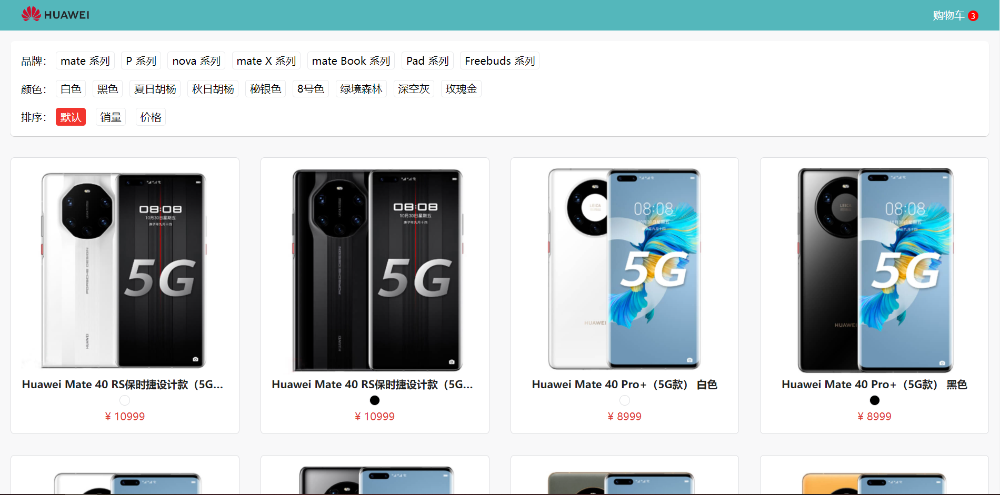
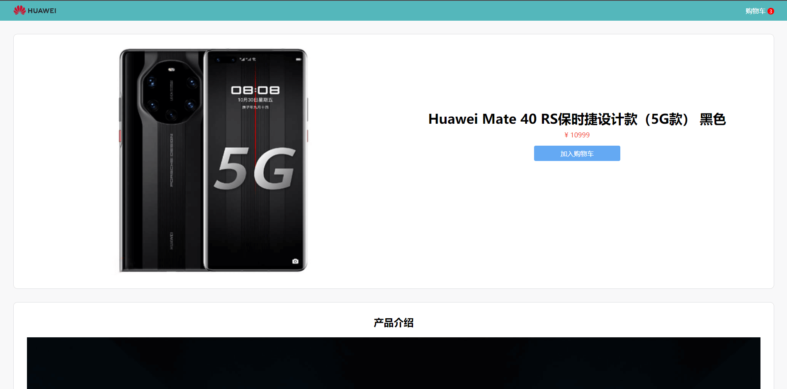
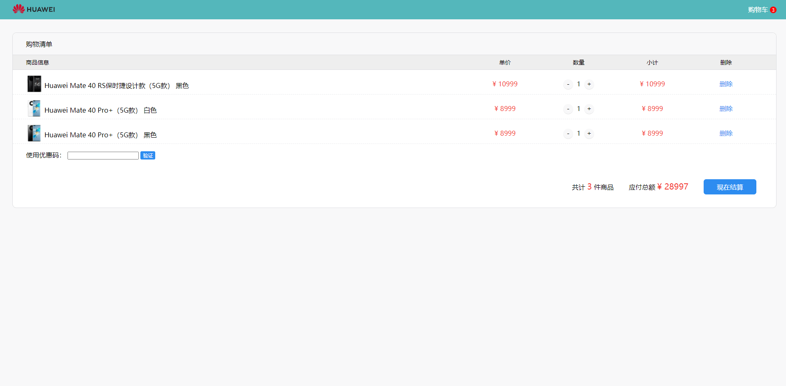

# VMALL

一个简单的`电商web`端系统

## 展示

- 首页



- 商品详情页



- 购物车



## 功能介绍

该项目主要具备以下几个功能:

- 商品筛选

  可以根据`商品类别`、`商品颜色`对商城内的商品进行筛选。
  
- 商品排序

  商品默认排序是按照商家提供的商品顺序进行展示，你可以选择你想要的排列顺序，包括按照`价格`排序，按照`销量`排序。
  
- 加入购物车

  当鼠标光标悬停在商品上时，商品右上角会弹出“加入购物车”字样，点击该按钮，即可将商品加入购物车，你可以在购物车内看到你所选的商品详细信息，包括`商品缩略图`、`商品名称`、`商品颜色`、`商品价格`、`商品数量`、`小计`等信息。
  
- 商品详情展示

  商品详情页展示了当前商品的详细信息，包括`外观`、`配置`、`价格`、`功能`等。
  
- 优惠券使用

  在购物车内，有一个使用优惠券的输入框，输入优惠码，即可使用优惠券，最后商品的总计价格为`实际价格-优惠价格`。
  
- 商品数量修改

  在购物车内，每个商品后面都会有个修改数量的按钮，你可以自由修改商品数量，点击“删除”按钮可以将当前商品从购物车中移除。
  
- 其他

  其他功能请自行探索

## 如何开始

```bash
// 安装依赖
npm install

// 本地启动
npm run dev

// 代码打包
npm run build

```

## 特别提醒

  该项目出于个人爱好，不涉及任何商业应用，里面所有商品均为虚拟商品。如有疑问，请QQ联系：1976457550
